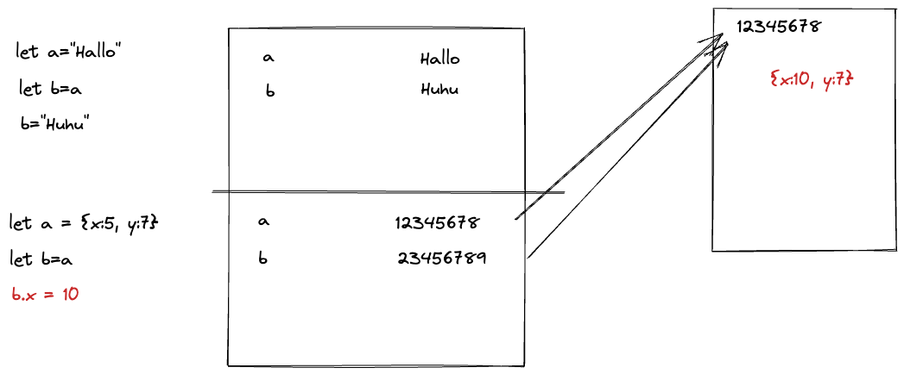

# Mentoring 12.08.2022

## Themen

- Primitive Types vs. Reference Types
  - Primitive Types:
    - string
    - boolean
    - number
  - Reference Types:
    - Objekte
    - Arrays
  - 
- Spread Operator
  - Der Spread-Operator (`...`) "schüttet" die Werte aus einem Objekt oder Array aus, um sie z.B. in ein neues Objekt/Array oder als Parameter einer Funktion einzufügen:
    ```
    const person={firstName: "John", lastName: "Smith"};
    const job={role: "Teacher"}
    const employee={...person, ...job}
    console.log(employee) // => {firstName:"John", lastName:"Smith", role:"Teacher"}
    ```
- Object Destructuring
  - Mit Object Destructuring, kann ich bestimmte Werte aus einem Objekt "herauspicken", um sie als Einzelvariablen verwenden zu können:
  ```
  const person={firstName: "John", lastName: "Smith", age: 54};
  const {firstName} = person;
  console.log(firstName) // => John
  ```
  - Mit dem Rest-Operator (auch wieder `...`) kann ich den kompletten Rest eines Objekts mit den Werten, die ich NICHT "herausgepickt" habe, in ein neues Objekt übergeben:
  ```
  const person={firstName: "John", lastName: "Smith", age: 54};
  const {firstName, ...rest} = person;
  console.log(firstName) // => John
  console.log(rest) // => {lastName: "Smith", age: 54}
  ```
  - WICHTIG! Der Name des neuen Objekts muss nicht `rest` sein, man kann jeden beliebigen Namen verwenden:
  ```
  const {firstName, ...irgendetwas} = person;
  console.log(irgendetwas) // => {lastName: "Smith", age: 54}
  ```
